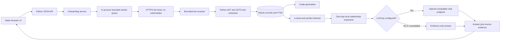

# FINAL_REPORT.md

## 1. Project summary

Onboard Agent is a local MVP that accepts public GitHub repository URLs, scans repository text without executing it, stores code metadata in SQLite, produces a structured onboarding guide, and provides repository search and conversational Q&A.

What works today:

- GitHub URL validation and asynchronous analysis job creation.
- Shallow Git checkout with submodules disabled and a clone timeout.
- Bounded scanning, Python AST extraction, conservative JavaScript/TypeScript extraction, and local relationship indexing.
- Secret-value redaction before source text is stored in the database or sent to an optional model endpoint.
- Overview, guide, files, symbols, route patterns, dependency relationships, search, saved conversations, and follow-up chat APIs/UI.
- Evidence-only answers by default, with optional OpenAI-compatible chat completion support.

Current limitations: this is a loopback-first, single-process MVP. It has no authentication, private-repository support, durable worker queue, PostgreSQL, vector database, embeddings, reranker, or broad multi-language parser coverage. Secret redaction is heuristic. Live GitHub cloning and real model-provider calls were not exercised in the verification run.

## 2. Final architecture



The Python service serves both the JSON API and static frontend from one process. A two-worker `ThreadPoolExecutor` performs repository analysis; a semaphore admits at most six active or queued analysis jobs. Job state is persisted in SQLite, but active work is not resumed after a process restart.

Repository source is ingested as data. The analyzer does not import or execute repository code. Git is restricted to HTTPS for the clone operation, system/global Git configuration is disabled, hooks are pointed at an empty directory, and submodules are disabled.

## 3. Technology stack

| Layer | Technology | Purpose |
|---|---|---|
| Frontend | HTML, CSS, browser JavaScript | Local repository dashboard, guide, file browser, routes, chat |
| Backend | Python 3.11+ standard library | HTTP server, services, worker, Git process wrapper, analysis |
| Database | SQLite | Repository/job metadata, file content, symbols, relationships, guides, conversations |
| Keyword index | SQLite FTS5 when available; bounded SQL `LIKE` fallback | Local lexical retrieval |
| Vector store | Not implemented | No vector database is configured |
| LLM | Optional OpenAI-compatible Chat Completions API | Explain retrieved evidence when configured |
| Embeddings | Not implemented | Search is lexical and structure-aware |
| Code parser | Python `ast`; regular expressions for JavaScript/TypeScript | Symbols, imports, route patterns, limited call relationships |
| Repository ingestion | Git CLI | Shallow, single-branch public GitHub clone |
| Queue/workers | `ThreadPoolExecutor` with a six-job admission bound | Background analysis in the app process |
| Cache | Not implemented | No Redis or application cache |
| Deployment | Local Python process | No container or cloud deployment is included |

SQLite avoids a separate service for the initial local product. FTS5 is used where the Python SQLite build supports it. An OpenAI-compatible provider adapter avoids an SDK dependency; changing providers requires a compatible Chat Completions endpoint or a replacement adapter.

## 4. Complete folder structure

```text
.
|-- backend/
|   |-- __init__.py
|   |-- analyzer.py
|   |-- config.py
|   |-- database.py
|   |-- github.py
|   |-- main.py
|   |-- retrieval.py
|   |-- server.py
|   `-- service.py
|-- frontend/
|   |-- app.js
|   |-- index.html
|   `-- styles.css
|-- tests/
|   |-- test_analyzer.py
|   |-- test_github.py
|   |-- test_retrieval.py
|   |-- test_server.py
|   `-- test_service.py
|-- .gitignore
|-- pyproject.toml
|-- README.md
`-- FINAL_REPORT.md
```

At runtime, `data/` is created for `onboard.db` and shallow repository checkouts. It is ignored by Git and is not a committed source folder. Python bytecode/cache folders are also ignored.

## 5. File-by-file implementation report

### `backend/config.py`

**Purpose and responsibilities:** Defines immutable environment-backed settings, project root, SQLite location, repository storage location, Git timeout, and optional LLM configuration.

**Functions/classes:** `Settings`, module-level `settings`.

**Dependencies:** `os`, `pathlib`, `dataclasses`.

**Used by:** Database, Git ingestion, retrieval, service, and HTTP server.

**Important details:** Defaults bind the web service to `127.0.0.1:8000`; the data directory defaults to the project `data/` folder.

### `backend/database.py`

**Purpose and responsibilities:** Creates SQLite schema and short-lived connections; enables foreign keys, WAL mode, busy timeout, and optional FTS5 triggers.

**Functions/classes:** `connect`, `initialize`, `fts_available`.

**Dependencies:** `sqlite3`, `contextlib`, `backend.config`.

**Used by:** `backend.service` and `backend.retrieval`.

**Important details:** The `connect` context manager commits on success and rolls back on failure. The schema includes `repositories`, `jobs`, `files`, `symbols`, `relationships`, `api_routes`, `guides`, `conversations`, and `messages`. FTS5 is optional; startup catches its absence and retrieval falls back to SQL text matching.

### `backend/github.py`

**Purpose and responsibilities:** Validates the public GitHub URL format and performs the shallow clone into a generated data-directory path.

**Functions/classes:** `RepositoryInputError`, `GitHubRepository`, `validate_github_url`, `_remove_generated_path`, `clone_repository`.

**Dependencies:** `os`, `re`, `shutil`, `subprocess`, `tempfile`, `urllib.parse`, `backend.config`.

**Used by:** `backend.service` and `backend.server`.

**Important details:** Only HTTPS `github.com/owner/repository` URLs are accepted. Clone uses a timeout, disables submodules and Git system/global configuration, disables LFS smudging, redirects hooks, and allows only HTTPS Git protocols. It does not run repository scripts. The repository's live download path was not exercised in the automated run.

### `backend/analyzer.py`

**Purpose and responsibilities:** Scans bounded text files, classifies them, redacts likely secrets, extracts supported code facts, builds local relationships, and generates structured onboarding guide data.

**Functions/classes:** `redact_secrets`, `_classify`, `_read_files`, `_python_symbols`, `_function_signature`, `_module_key`, `_resolve_python_import`, `_resolve_js_import`, `analyze_repository`, `_top_level_directories`, `_dependencies_from_manifests`, `generate_guide`.

**Dependencies:** `ast`, `hashlib`, `json`, `os`, `posixpath`, `re`, `tomllib`, and standard collection/path utilities.

**Used by:** `backend.service`.

**Important details:** Limits are 12,000 indexed files, 20,000 directories, 50,000 file candidates, 750,000 bytes per file, and 80,000,000 total indexed file bytes. Common generated/vendor folders, symlinks, binary files, and oversized files are skipped. Python AST extraction covers classes, functions, imports, route decorators, and calls that resolve to one unique function name. JavaScript/TypeScript use conservative regular expressions. Other supported text types are classified but not deeply parsed. Secret detection is heuristic.

### `backend/retrieval.py`

**Purpose and responsibilities:** Searches the FTS5/`LIKE` index, scores path/body/symbol matches, returns bounded source excerpts, adds directly connected files, and calls an optional model provider.

**Functions/classes:** `_tokens`, `_excerpt`, `search_repository`, `OpenAICompatibleClient`, `make_evidence_answer`.

**Dependencies:** `json`, `logging`, `re`, `sqlite3`, `urllib`, `backend.config`, and `backend.database`.

**Used by:** `backend.service`.

**Important details:** Retrieval returns at most eight results by default, with each excerpt capped at 3,000 characters and individual long lines truncated. The model receives retrieved excerpts and up to eight prior conversation messages, not the whole repository. Without a key or when the provider fails, the service returns an evidence-only response.

### `backend/service.py`

**Purpose and responsibilities:** Owns repository registration, analysis job lifecycle, persistence, overview and guide queries, file/symbol/API access, search, chat context, and saved conversations.

**Functions/classes:** `utc_now`, `_repo_dict`, `OnboardingService` and its repository, worker, overview, file, symbol, route, guide, search, chat, and conversation methods.

**Dependencies:** `backend.analyzer`, `backend.config`, `backend.database`, `backend.github`, `backend.retrieval`, and `concurrent.futures`.

**Used by:** `backend.server`.

**Important details:** Repository analysis is transactional when writing the structured results. Duplicate submissions for a repository with an active job reuse that job. The worker catches failures, persists job/repository failure state, and writes a structured log. Restarted active jobs are marked failed at startup; they are not retried automatically.

### `backend/server.py`

**Purpose and responsibilities:** Implements the same-origin JSON API, static file serving, request validation, response status mapping, and threaded HTTP listener.

**Functions/classes:** `make_handler`, `_bounded_int`, `serve`, and the generated `Handler` class.

**Dependencies:** `http.server`, `json`, `logging`, `urllib.parse`, `backend.config`, `backend.github`, `backend.service`.

**Used by:** `backend.main`.

**Important details:** JSON bodies are capped at 256 KB. Responses include `nosniff`, frame, referrer, and content security headers. There is no authentication. The default bind is loopback; do not expose the server to a network without adding access controls.

### `backend/main.py`

**Purpose and responsibilities:** Configures basic logging and starts the service.

**Functions/classes:** `main`.

**Dependencies:** `logging`, `backend.server`.

**Used by:** `python -m backend.main` and the optional project script in `pyproject.toml`.

### `frontend/index.html`

**Purpose and responsibilities:** Declares the application shell, repository form, navigation, workspace, status banners, and script/style links.

**Functions/classes:** Static HTML document; no application functions.

**Dependencies:** `/styles.css` and `/app.js` served by `backend.server`.

**Used by:** Browser clients that load `/`.

### `frontend/app.js`

**Purpose and responsibilities:** Drives repository selection, job polling, overview, onboarding guide, file and symbol browsing, API route display, chat, citations, and conversation history.

**Functions/classes:** `escapeHtml`, `api`, `toast`, `showRepositoryForm`, `setView`, `refreshRepositories`, `loadRepository`, `pageHeading`, `renderView`, `renderOverview`, `renderGuide`, `renderFiles`, `renderApis`, `markdownLite`, `renderMessage`, `renderChat`, and conversation/event helpers.

**Dependencies:** Browser `fetch`, DOM APIs, `localStorage`, and the JSON API.

**Used by:** `frontend/index.html`.

**Important details:** Dynamic repository text is HTML-escaped before insertion. Source citations open the corresponding file view. The file browser shows at most 500 files per request and the symbol count reflects at most 500 returned symbols.

### `frontend/styles.css`

**Purpose and responsibilities:** Provides responsive dark dashboard styling for desktop and mobile layouts.

**Functions/classes:** CSS rules for workspace, overview, guide, files, API routes, chat, and responsive breakpoints.

**Dependencies:** None; fonts use local system fallbacks.

**Used by:** `frontend/index.html`.

### Tests and project files

| File | Purpose and important coverage | Dependencies / used by |
|---|---|---|
| `tests/test_analyzer.py` | Python/JS imports, symbols, routes, calls, secret redaction, guide generation, ignored generated folder | `unittest`; run by the test command |
| `tests/test_github.py` | GitHub URL accept/reject cases | `unittest`; validates `backend.github` |
| `tests/test_retrieval.py` | Symbol retrieval, source line excerpts, direct related-file expansion, empty queries | `unittest`; uses a temporary SQLite DB |
| `tests/test_server.py` | Health route and bad URL response status | `unittest`; uses an ephemeral local HTTP server |
| `tests/test_service.py` | Registration through completion, persistence, redaction, routes, guide, and follow-up chat with mocked clone | `unittest`; uses temporary storage |
| `pyproject.toml` | Project metadata and optional `onboard-agent` entry point; no external dependencies | Python packaging metadata |
| `.gitignore` | Excludes runtime data, bytecode, virtual environments, and test cache | Git |
| `README.md` | Setup, operating boundaries, API inventory, environment variables, and test commands | Developer handoff |
| `FINAL_REPORT.md` | This implementation and verification report | Maintainers |

## 6. API documentation

Authentication is not implemented. The default server binds to `127.0.0.1`. API IDs are opaque UUID strings. Error responses use `{"error":"..."}`. Repository analysis routes return `202`; invalid input returns `400`, missing resources `404`, not-ready/conflict states `409`, and unexpected server errors `500`.

| Method and endpoint | Purpose; request | Response | Service/data used |
|---|---|---|---|
| `GET /api/health` | Health check; no body | `{status, llm_enabled}` | Server/config; no entity lookup |
| `POST /api/repositories/validate` | Validate a URL; `{url}` | `{valid, owner, name, canonical_url, public_only}` | URL validator; no DB write |
| `GET /api/repositories` | List repositories | `{repositories:[...]}` including latest job ID and file count | Repository service; `repositories`, `jobs`, `files` |
| `POST /api/repositories` | Register and queue; `{url}` | `202 {repository_id, job_id, status, owner, name}`; duplicate active work reuses the active job | Repository/job service; `repositories`, `jobs` |
| `GET /api/repositories/{id}` | Read repository and latest job | Repository fields plus `latest_job` | `repositories`, `jobs` |
| `GET /api/repositories/{id}/status` | Read analysis status | Same repository/latest-job status object | `repositories`, `jobs` |
| `POST /api/repositories/{id}/analyze` | Queue full re-analysis; empty JSON body accepted | `202 {repository_id, job_id, status}` | Job service; `repositories`, `jobs` |
| `GET /api/repositories/{id}/overview` | Counts, language extensions, README excerpt, notable symbols, limits, LLM availability | Overview object | `files`, `symbols`, `relationships`, `api_routes`, `jobs` |
| `GET /api/repositories/{id}/guide` | Read generated onboarding material | Guide JSON with overview, structure, import graph, entry points, routes, dependencies, environment names, commands, tests, deployment files, limitations | `guides` |
| `GET /api/repositories/{id}/files?query=&limit=` | List/search paths | `{files:[path,kind,size,line_count,sha256]}` | `files`; limit is bounded to 500 |
| `GET /api/repositories/{id}/files/content?path=...` | Read sanitized indexed file and relations | File metadata, sanitized content, symbols, relationships | `files`, `symbols`, `relationships` |
| `GET /api/repositories/{id}/symbols?query=&limit=` | Search/list extracted symbols | `{symbols:[...]}` | `symbols`; limit is bounded to 500 |
| `GET /api/repositories/{id}/dependencies?path=&limit=` | Read graph edges, optionally for a path | `{relationships:[...]}` | `relationships`; limit is bounded to 1,000 |
| `GET /api/repositories/{id}/apis?query=` | Read route patterns | `{routes:[method,path,file_path,handler,line_number]}` | `api_routes` |
| `GET /api/repositories/{id}/search?query=&limit=` | Retrieve bounded repository evidence | `{query,results:[path,score,excerpt,line range,reason]}` | FTS5/`LIKE`, `files`, `symbols`, `relationships` |
| `POST /api/repositories/{id}/chat` | Ask/follow up; `{question, conversation_id?}` | `{conversation_id,answer,evidence,mode}` | Retrieval, optional LLM, `conversations`, `messages` |
| `GET /api/repositories/{id}/conversations` | List recent saved conversations | `{conversations:[id,created_at,updated_at,preview]}` | `conversations`, `messages` |
| `GET /api/repositories/{id}/conversations/{conversation_id}` | Read message history and evidence | `{conversation,messages:[role,content,evidence,created_at]}` | `conversations`, `messages` |

The frontend also receives `GET /`, `GET /app.js`, and `GET /styles.css` from the same server. There are no delete endpoints, user accounts, API tokens, or CORS configuration.

## 7. Database

SQLite schema is initialized from `backend/database.py`; there is no versioned migration system.

| Table | Purpose and relationships |
|---|---|
| `repositories` | Canonical URL, owner/name, branch, status, timestamps, and error; parent of jobs, files, relationships, routes, guides, and conversations |
| `jobs` | Persisted analysis job state, timestamps, error, and file/symbol counts; belongs to one repository |
| `files` | Sanitized indexed text, kind, size, SHA-256 of raw source, line count; composite key `(repository_id,path)` |
| `symbols` | Extracted function/class/type names, source lines, signature, docstring; references its file by `(repository_id,file_path)` |
| `relationships` | File/symbol/API relationship edges and evidence; keys are textual and are not foreign-key validated |
| `api_routes` | Extracted method/path/source/handler/line route patterns |
| `guides` | JSON guide content and generation timestamp; one row per repository |
| `conversations` | Saved chat sessions tied to a repository |
| `messages` | User/assistant messages and evidence metadata tied to a conversation |
| `file_search` | Optional SQLite FTS5 virtual index over path and sanitized content; insert/delete triggers mirror `files` |

Indexes cover job history by repository, file kind, symbol name/file, relationship source/target, API route path, and conversation message order. SQLite foreign keys are enabled. The database uses WAL and a 20-second busy timeout.

## 8. Repository analysis flow

1. Validate HTTPS GitHub host, owner/repository syntax, and reject credentials, query strings, fragments, and nested paths.
2. Register or find the repository and persist a job. A bounded in-process queue runs the job asynchronously.
3. Shallow-clone the canonical repository URL into generated storage. Git submodules are disabled; the application never executes repository code.
4. Walk the checkout with directory, candidate, file, and total-byte limits. Skip common generated/vendor directories, symlinks, binary files, and oversized files.
5. Redact likely secret values, hash raw bytes, classify files, and parse supported source syntax.
6. Extract file records, Python/JS/TS symbols, import edges, uniquely resolved Python call edges, API route patterns, and environment/dependency names.
7. In one SQLite transaction, replace prior indexed results, store relationships/routes, generate the guide, and mark the job complete.
8. FTS5 or a bounded `LIKE` fallback serves lexical search. Retrieval adds symbols and direct file relationships and returns limited source excerpts.
9. Chat uses those excerpts for evidence-only responses or, when configured, a provider call.

File SHA-256 values are stored, but there is no incremental change detector; re-analysis clones and scans the repository again.

## 9. AI agent flow

```text
User question
  -> load conversation history
  -> if the question refers to prior context, include the prior user question in retrieval
  -> tokenize and query FTS5 (or bounded LIKE fallback)
  -> boost path/symbol/body matches
  -> add directly connected files when space remains
  -> cap excerpts and context size
  -> optional OpenAI-compatible chat completion
  -> evidence-only fallback if no key/provider response
  -> persist answer and source path/line metadata
```

The current system is not an autonomous multi-tool agent. It has one retrieval path, without planner-generated tool selection, a reranker, query decomposition, embedding search, or context compression. When the model is enabled, repository text is explicitly marked untrusted in the system prompt and answers are asked to separate fact from inference and cite source ranges. Evidence metadata is returned separately so the UI can navigate to the source file.

## 10. Code intelligence

- **Files:** Recognized text extensions and common manifest/config filenames are classified as documentation, configuration, tests, source, or other.
- **Python symbols:** AST extraction records top-level functions/classes and class methods, source line ranges, signatures, and docstrings.
- **JavaScript/TypeScript symbols:** Text patterns extract common class/function/interface/type/enum and arrow declarations.
- **Imports:** Python absolute/relative imports and JS/TS import/export/require strings are resolved when a matching local file is found.
- **Calls:** Python calls are linked only when the called name matches exactly one extracted repository function name; the relationship is labeled `calls (name match)` to communicate the inference limit.
- **Routes:** Python route decorators and common JS/TS HTTP method patterns create route records. They are static source matches, not runtime route verification.
- **Relationships:** File-to-symbol `defines`, file-to-file `imports`, symbol-to-symbol name-matched `calls`, and file-to-API `defines route` edges are stored.
- **Dependencies/config:** Package manifests and imports contribute package names; `.env` keys and common environment access patterns contribute variable names. Values from `.env` files are redacted.

No universal call graph, feature grouping, SQL ORM model discovery, API request/response schema extraction, frontend-to-backend semantic mapping, queue/worker inference, or database relationship reconstruction is implemented.

## 11. Onboarding guide generation

`generate_guide` stores a JSON guide after successful analysis. It contains a README excerpt, technology/dependency clues, top-level directory counts/examples, a Mermaid diagram of resolved local import edges, common-filename entry point matches, detected API route patterns, environment variable names, setup/test commands only where supported by manifests or test evidence, test paths, detected Docker/CI files, and explicit analysis limitations.

Feature-by-feature business-flow narratives, database/authentication documentation, and an architecture diagram for inferred systems are not currently generated. Empty or unknown areas are reported as unconfirmed instead of invented.

## 12. Testing

**Framework and command:** Python standard-library `unittest`; run `python -m unittest discover -s tests -v`.

**Test files:**

- `tests/test_github.py`: URL validation allow/deny cases.
- `tests/test_analyzer.py`: Python and JS/TS symbols/imports/routes/calls, generated-folder exclusion, redaction, guide output.
- `tests/test_retrieval.py`: symbol search, source excerpts, structural expansion, and empty-query behavior.
- `tests/test_server.py`: health endpoint and client error for invalid repository URL.
- `tests/test_service.py`: end-to-end service/job persistence, file redaction, guide, route access, chat, and follow-up using a mocked clone.

**Results:** 12 tests passed. `python -m compileall -q backend tests` passed. `node --check frontend/app.js` passed. A localhost HTTP smoke check returned status 200 for `/`, `/app.js`, `/api/health`, and `/api/repositories`. The in-app browser runtime was unavailable, so the visual click-through was not completed. Live GitHub network cloning and a real LLM call were not tested.

Coverage percentage is not configured or measured. The test suite does not yet cover large repositories, unsupported-language fixtures, symlink/path edge cases, queue saturation, external Git failure, provider errors, or browser interaction.

## 13. Environment variables

| Variable | Required | Default | Purpose |
|---|---:|---|---|
| `HOST` | No | `127.0.0.1` | HTTP bind address |
| `PORT` | No | `8000` | HTTP port |
| `ONBOARD_DATA_DIR` | No | `<project>/data` | SQLite and clone storage directory |
| `CLONE_TIMEOUT_SECONDS` | No | `180` | Git clone timeout |
| `OPENAI_API_KEY` | No | unset | Enables optional LLM answers; secret value is not committed |
| `LLM_BASE_URL` | No | `https://api.openai.com/v1` | OpenAI-compatible API base URL |
| `LLM_MODEL` | No | `gpt-4.1-mini` | Chat model name |

No GitHub token is required for public repositories. The service does not read private-repository credentials.

## 14. How to run

From `D:\projects\OnboardAent` in PowerShell:

```powershell
python --version
git --version
python -m backend.main
```

Open `http://127.0.0.1:8000`. The API, frontend, and analysis worker share that process. SQLite is created automatically; there is no separate database command. To start analysis from PowerShell:

```powershell
Invoke-RestMethod -Method Post `
  -Uri 'http://127.0.0.1:8000/api/repositories' `
  -ContentType 'application/json' `
  -Body '{"url":"https://github.com/owner/repository"}'
```

The response gives a `repository_id`. Check `GET /api/repositories/{repository_id}/status` for completion. There is no separate worker command. Run tests with `python -m unittest discover -s tests -v`; run syntax checks with `python -m compileall -q backend tests` and `node --check frontend/app.js`.

## 15. Currently working

- Same-origin static dashboard and JSON service start without package installation.
- Public HTTPS GitHub URL validation and asynchronous repository job lifecycle.
- Clone wrapper is implemented with the restrictions described above; automated tests mock the clone operation.
- Bounded file scan, classification, content redaction, hashes, line counts, and SQLite persistence.
- Python AST symbols/imports/routes and conservative JS/TS symbols/imports/routes.
- Local import edges and uniquely name-matched Python call edges.
- FTS5 lexical retrieval with SQL text-search fallback and direct relationship expansion.
- Guide, overview, files/source view, symbols metadata, routes, conversations, follow-up context, evidence chips.
- Evidence-only chatbot works without external credentials. OpenAI-compatible provider adapter is implemented but not live-verified.
- Twelve automated tests pass; Python compile, JavaScript syntax, and localhost HTTP smoke checks pass.

## 16. Partially implemented

- **Multi-language analysis:** only Python AST and regex-based JS/TS extraction are deeper than classification.
- **Architecture and feature understanding:** local import diagrams and API route lists exist; features and cross-service workflows are not grouped or inferred.
- **Chat agent:** repository retrieval, history, evidence, and optional model call exist; there is no multi-tool planner or model evaluation suite.
- **Onboarding guide:** key static sections exist, but feature flows, database/auth details, and production deployment explanations are absent unless directly represented by surfaced files.
- **Scalability:** input limits, an in-process bounded worker queue, FTS5, hashes, and capped excerpts exist; there is no durable queue, incremental indexing, caching, or distributed processing.
- **Secret handling:** common patterns are redacted, but detection is heuristic and the raw shallow clone remains on disk under the configured data directory.

## 17. Not implemented

- User accounts, authentication, authorization, organization/tenant isolation, or private GitHub repositories.
- PostgreSQL, migrations, Redis, durable/distributed workers, automatic retry, or job recovery after restart.
- Embeddings, vector storage, semantic retrieval, reranking, or query decomposition.
- Tree-sitter/LSP and deep parsers for Java, Go, Rust, C#, PHP, SQL, and other languages.
- Reliable framework-specific request/response, ORM, schema/migration, auth, worker/queue, and external service discovery.
- Feature graph/grouping, change recommendations, interactive architecture graph, or runtime endpoint validation.
- Prompt-injection/security evaluation datasets, retrieval accuracy/citation metrics, or provider cost telemetry.
- Docker/CI deployment, cloud provisioning, production observability, or multi-user operation.

## 18. Known issues

- The visual browser check was not possible because the browser runtime reported no available browser. HTTP smoke tests were used instead.
- A live clone was not run in verification. Runtime analysis needs Git and network access to GitHub.
- Git has a timeout and partial-blob request, but clone metadata/storage itself has no hard disk quota. Extremely large repositories can still consume resources before the scanner limits apply.
- Secret redaction is pattern-based. Novel credentials may be missed. Raw repository checkouts include original source values and are stored locally; the app does not provide private-repository credentials or a secure hosted storage boundary.
- With `OPENAI_API_KEY`, up to eight redacted repository excerpts and recent conversation messages are sent to `LLM_BASE_URL`. Provider retention/security is outside this application.
- Python import resolution assumes paths correspond to import module names. Monorepo roots, namespace packages, dynamic imports, and custom path configuration can prevent or misdirect matches.
- Call edges rely on a globally unique function name and are explicitly labeled as name matches. They are not a static call graph proof.
- Route patterns may include false positives or miss dynamic/decorator-based routes. They are not runtime-verified.
- Analysis persists status, but queued/processing jobs are marked failed after server restart and are not resumed.
- The UI file list and symbol summary are capped at 500 records per request; the guide displays up to 250 detected routes.
- The API has no authentication or rate limit. `HOST` can be overridden; binding beyond loopback would expose source and chat endpoints to network clients.
- SQLite schema is initialized with `CREATE TABLE IF NOT EXISTS`; there is no formal migration/versioning workflow.

## 19. What needs to change next

| File/folder | What needs to change | Why | Dependencies | Expected impact |
|---|---|---|---|---|
| `backend/analyzer.py` | Add parser adapters, accurate package/module resolution, schema/auth/worker detectors, feature clustering, and parser fixture suite | Current analysis is shallow outside Python and JS/TS | Tree-sitter or selected language parsers; evaluation fixtures | Better cross-file explanations and fewer missed relationships |
| `backend/database.py` and a new `migrations/` folder | Add versioned migrations and move production metadata to PostgreSQL if multi-user operation is required | Startup DDL is not a safe production migration strategy | Migration tool and PostgreSQL operations | Controlled schema upgrades and concurrent use |
| `backend/service.py` and worker modules | Replace in-process queue with durable jobs, retries, recovery, per-repository locks, and incremental file hashes | Current jobs do not resume and every analysis is full | Durable queue or database-backed worker | Reliable analysis under restart and higher load |
| `backend/retrieval.py` | Add embedding provider abstraction, hybrid scoring, reranking, and retrieval evaluation | Lexical search misses semantic matches | Embedding/vector provider and labelled Q&A fixtures | Better question-to-evidence recall with measurable quality |
| `backend/analyzer.py`, `backend/service.py` | Replace heuristic secret redaction with an audited secret scanner and configurable clone retention/cleanup | False negatives and persistent raw clone data are known risks | Secret scanning library/rules, retention policy | Lower risk of secret exposure and less retained source |
| `backend/server.py`, `backend/service.py` | Add authentication, authorization, rate limits, and tenant scoping before any network deployment | Current API is local-only and unauthenticated | Identity provider/session design | Safe shared-service access |
| `frontend/app.js` and `frontend/` | Add richer symbol search, source line navigation, graph visualization, and loading/error states verified in a browser | Current UI is functional but basic and visually unverified in this session | Browser testing and UI evaluation | Better navigation for new developers |
| `tests/` | Add large/empty/unsupported-language fixtures, clone failures, queue saturation, provider errors, and browser tests | Current suite is a focused vertical slice | Browser automation availability and fixtures | Broader regression and security coverage |

## 20. Future roadmap

### Phase 1 - Harden the local MVP

Add robust parser fixtures, secret-scanner coverage, clone size/retention controls, job queue edge-case tests, and browser-based interaction checks.

### Phase 2 - Improve code intelligence and retrieval

Add parser adapters, framework-specific evidence, explicit feature relationships, incremental indexing, hybrid semantic retrieval, and a labelled evaluation dataset for citations and answer correctness.

### Phase 3 - Prepare a hosted product

Introduce authentication/tenant boundaries, migrations and PostgreSQL, durable workers, operational telemetry, deployment automation, quotas, and security review before binding to a shared network.

All three phases are future work; they are not represented as implemented capabilities.

## 21. Developer handoff

Start with `README.md`, then `backend/main.py` and `backend/server.py` for app startup and API routing. `backend/service.py` is the repository lifecycle boundary. `backend/github.py` validates and clones; `backend/analyzer.py` performs deterministic analysis and guide generation; `backend/database.py` defines persisted data; `backend/retrieval.py` powers search and chat. The static interface is in `frontend/`.

Run the application with `python -m backend.main`; run tests with `python -m unittest discover -s tests -v`. Repository data is under `data/`. Do not expose that directory or the unauthenticated API on a shared network. Repositories are untrusted source data: never add code execution to the analyzer. If configuring an LLM, remember that retrieved source excerpts leave the machine for the configured provider after heuristic redaction.

The next high-value work is adding evaluation fixtures for difficult cross-file questions and improving parsers/secret handling. Then add durable job recovery and incremental indexing before expanding to a hosted or multi-user deployment.
